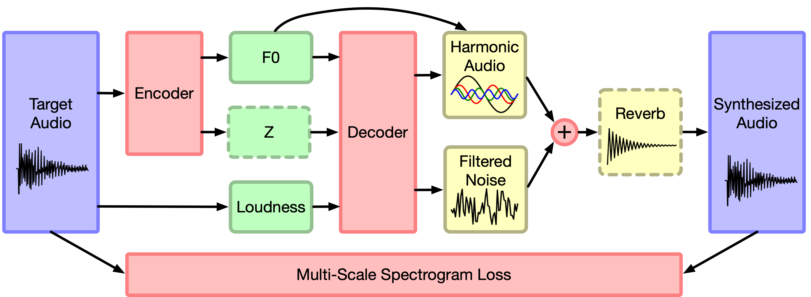
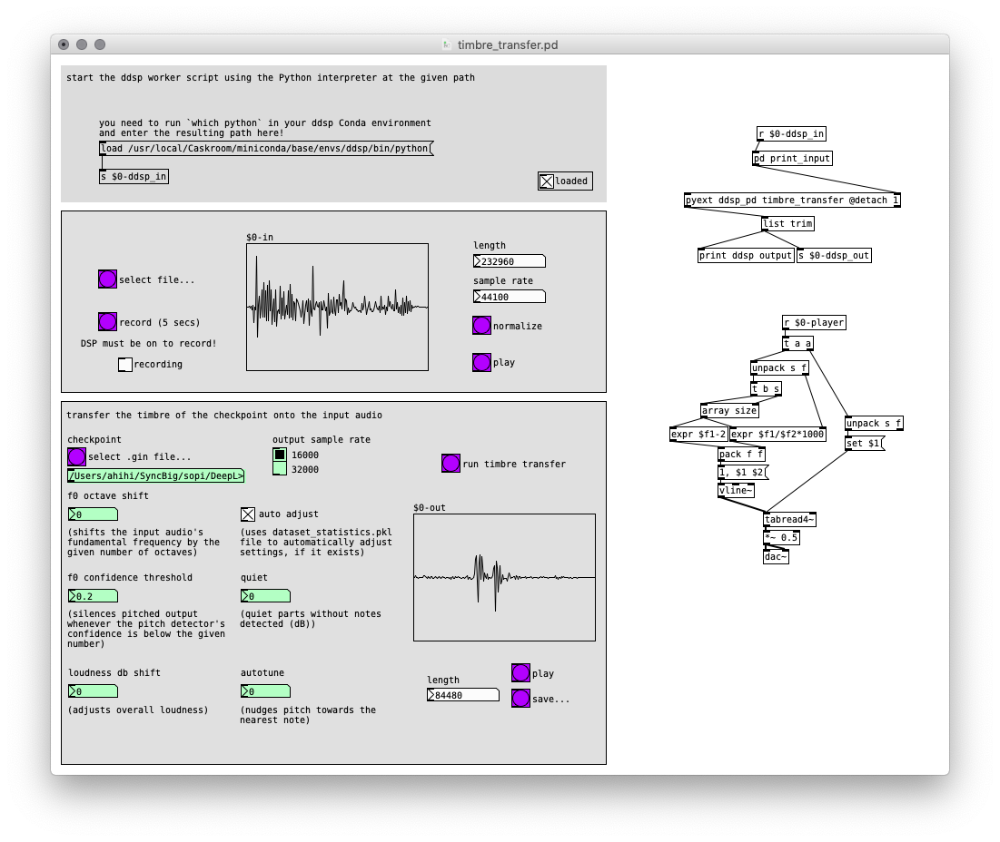

# DDSP

DDSP (Differentiable Digital Signal Processing) is a library for generating audio through a combination of standard DSP techniques and deep learning, introduced by Magenta in January 2020. Instead of directly generating audio samples or frequency spectra, DDSP's approach is to provide a library of DSP elements (oscillators, filters, reverbs...) implemented as differentiable functions, allowing them to be used as components of deep learning models that are trained with backpropagation and gradient descent.

In a DDSP model, the neural network is tasked with generating parameters for the DSP elements, which then synthesize or process audio according to these parameters. Since the behavior of standard DSP elements is well understood, this allows greater interpretability (understanding how the model operates) compared to the typical black-box nature of deep learning models.

## Timbre transfer

DDSP is a very general toolkit and probably has lots of potential applications still to be discovered. One of the first examples showcased by the authors is timbre transfer. A DDSP model is trained on 10-20 minutes of audio from an instrument and learns a representation of the instrument's timbre, which can then be transferred to other input audio. For example, a sung melody can be turned into violin.

The model works by trying to reconstruct sounds from the training dataset using spectral modeling synthesis. Spectral modeling synthesis (also known as harmonics plus noise model) combines a harmonic additive oscillator and a filtered noise generator, both varying in time to synthesize complex timbres.



The input audio is divided into short frames, and three encoders produce latent representations of fundamental frequency, loudness and timbre information. These are fed into a decoder, which translates the latent representations into parameters for the additive oscillator and filtered noise. Finally, the summed signal from these is optionally passed through a convolution reverb. In the examples, the reverb impulse response is fixed, but it could in principle be learned automatically from the training dataset!

## Setup (macOS/Linux)

First make sure you have [pyext](../utilities/pyext-setup/) set up.

We will make a separate Conda environment for DDSP in order to avoid any version conflicts with Magenta.

Create the environment:

----

### on macOS

```
conda create -n ddsp python=3.7 pandas=0.24
```

### on Linux

```
conda create -n ddsp python=3.7 tensorflow=2.4.1 tensorflow-probability pandas=0.24
```

If you have an NVIDIA GPU with CUDA support, you can use `tensorflow-gpu` instead for much better performance:

```
conda create -n ddsp python=3.7 tensorflow-gpu=2.4.1 tensorflow-probability pandas=0.24
```

----

Activate it:

```
conda activate ddsp
```

Enter the ddsp directory in the course repository (in this example, located in the home directory):

```
cd ~/DeepLearningWithAudio/02_ddsp
```

Clone the DDSP repository:

```
git clone https://github.com/SopiMlab/ddsp.git
```

Enter the resulting directory:

```
cd ddsp
```

Install DDSP:

```
pip install -e .
```

Install Google Colab libraries:

```
pip install google-colab
```

(TODO: can we do without `google-colab`? It's unfortunate that we need to pull in such a big library for a few helper functions)

Install the sopilib support library:

```
pip install -e ../../SopiLib/sopilib
```

Find out the path of your Python interpreter:

```
which python
```

Example output (your path may differ):

```
/usr/local/Caskroom/miniconda/base/envs/ddsp/bin/python
```

Open `timbre_transfer.pd`, edit the `load` message to use your path and click the reload button.

## timbre\_transfer.pd

The `timbre_transfer.pd` patch provides a Pd interface for experimenting with DDSP timbre transfer.



Its adjustable parameters are:

- Input audio file — Can be any sample rate. It will be converted to match the output sample rate.
- Checkpoint — A trained timbre transfer model
- Output sample rate — 16000 or 32000 Hz (seems like it needs to be a multiple of 16000). Pitch detection will have some issues when the training and generation sample rates don't match, but the results can be interesting.
- f₀ octave shift — Shifts the input audio's fundamental frequency by the given number of octaves
- f₀ confidence threshold — Silences input audio whenever the pitch detector's confidence is below the given number
- Loudness dB shift — Adjusts overall loudness
- Auto adjust — Uses `dataset_statistics.pkl` file to automatically adjust settings
- Quiet — Not sure what exactly this does! Maybe you can figure it out? ;)
- Autotune — Nudges pitch towards the nearest note

The timbre transfer is unfortunately quite slow without GPU acceleration (unsupported in TensorFlow on Mac), often taking minutes to generate even short samples.

## Checkpoints

A few example checkpoints are provided by the DDSP authors, and we've trained some additional ones. You can find all of them in the [SOPI Google Drive](https://drive.google.com/drive/folders/1yoJhvr2UY0ID3AP6jumUItJJGSkiBEg_).

## Training

See [DDSP training](training.md).

## Exercises

1. Try a few different combinations of input audio and checkpoint. What kind of observations can you make about how the inputs' characteristics affect the output?
2. Experiment with the f₀ octave shift, f₀ confidence threshold and loudness dB shift parameters. How does the algorithm respond to extreme values of these?
3. (optional) Prepare your own audio and [train](trainind.md) a new model.

## Links

- [DDSP: Differentiable Digital Signal Processing](https://storage.googleapis.com/ddsp/index.html)
